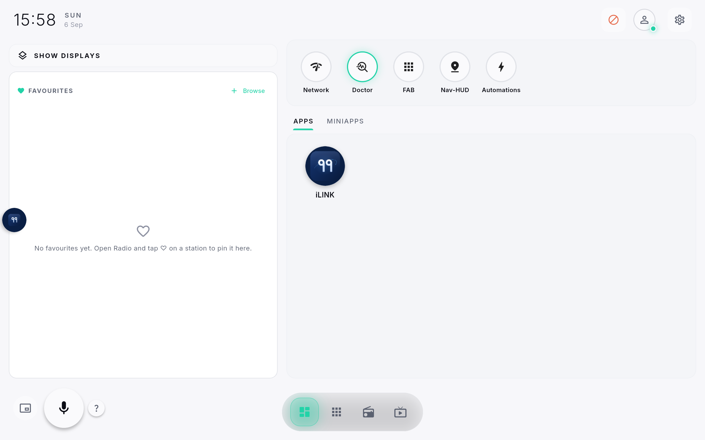
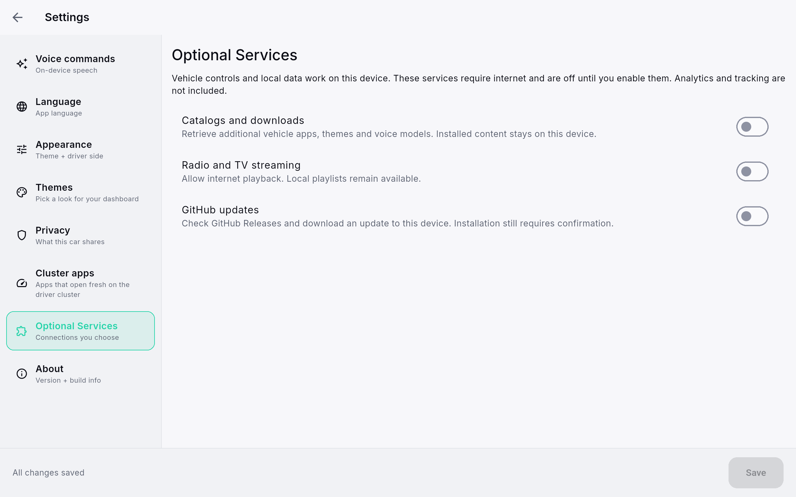
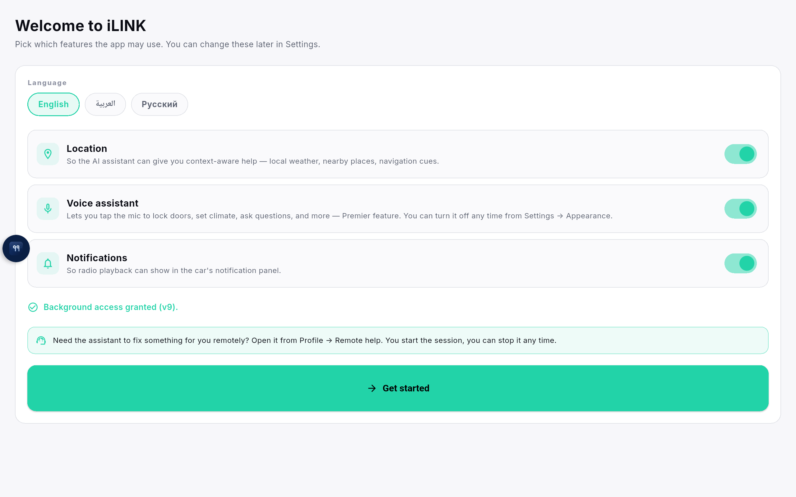
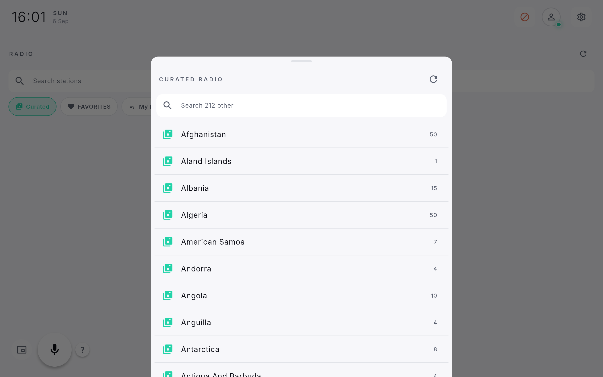
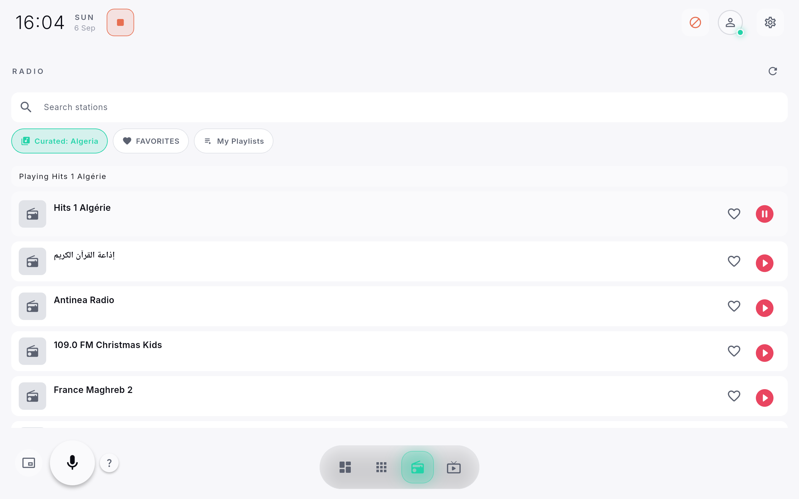
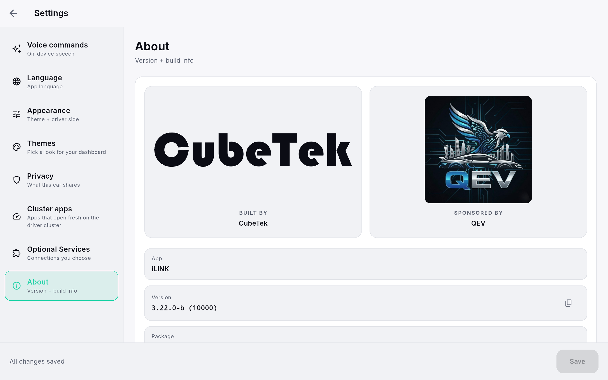

# iLINK

A standalone Flutter dashboard for BYD head units (Leopard 8 / DiLink 5.1).
Vehicle controls, automations and speech recognition all run **on the device** —
no account, no subscription, no hosted API, no MQTT broker, no license check.

<p align="center">
  
</p>

## What it does

- **Vehicle controls** — doors, climate, windows, lights, seats and comfort, through the
  Android/BYD bridge and a safety dispatcher that keeps stationary and per-action checks.
- **On-device speech** — English is bundled and provisions on first launch. Other languages
  come from a local import or an optional publisher download. No account, no cloud STT.
- **Automations** — create, import, edit and run workflows locally. Nothing syncs anywhere.
- **Radio and TV** — a bundled directory of **5,166 stations across 212 countries** browses
  and searches completely offline. Playing a live stream needs internet, and needs you to
  turn streaming on first.
- **Mini-apps and themes** — four mini-apps ship with the build. Import more from a local
  archive; each grant is bound to that app ID and that exact bundle's SHA-256.
- **Optional GitHub updates** — checks releases and verifies package, version, hash and
  installed certificate before offering an install.

## Privacy posture

Every outbound connection is behind a switch that ships **off**. There is no analytics SDK
and no telemetry — the vehicle and its data stay on the head unit unless you opt in.

<p align="center">
  
</p>

| Screen | |
| --- | --- |
|  | **First run** — pick a language (English, العربية, Русский) and choose what the app may use. |
|  | **Radio catalog** — 212 countries, browsed with no network at all. |
|  | **Now playing** — live stream with transport controls in the car's notification panel. |
|  | **About** — version and build info. |

## Try it without a car

You do not need a head unit to work on the UI. An ordinary Android emulator runs everything
except the vehicle actuators:

```sh
flutter pub get
flutter run -d emulator-5554 --dart-define-from-file=config/dev.json --dart-define=MOCK_CAR=true
```

Replace `emulator-5554` with the serial from `flutter devices`. `MOCK_CAR` feeds canned
vehicle replies — anything that "succeeds" there is simulated and proves nothing about real
hardware. See [the emulator guide](docs/workflow/emulator.md) for the full setup.

> The web target does **not** build. The on-device speech engine depends on `dart:ffi`,
> which the web compiler rejects. Use an emulator or a device.

With a real head unit attached:

```sh
flutter run --dart-define-from-file=config/dev.json
```

## Contributing

Contributions are welcome, and you can get productive without asking anyone for access —
no private submodule, no secrets, no backend. Everything the app needs is in this
repository.

- **[Orientation](docs/ORIENTATION.md)** — the "where do I start" tour: how the code is arranged, the two conventions that bite newcomers, and good first contributions.
- **[CONTRIBUTING.md](CONTRIBUTING.md)** — toolchain versions, fork/branch flow, the exact
  checks CI runs, and what hardware claims must be backed by.
- **[Architecture](docs/architecture.md)** and the [standalone design notes](docs/offline-first/README.md).
- **[Code of Conduct](CODE_OF_CONDUCT.md)** · **[Security policy](SECURITY.md)**

Run the same checks CI does before opening a PR:

```sh
dart format --set-exit-if-changed .
flutter analyze
flutter test
dart run tool/audit_hex.dart
dart run tool/validate_prod_config.dart
```

**Vehicle safety comes first.** Emulator and widget tests cannot establish firmware
compatibility, real vehicle signals or cluster behaviour. If a change touches those paths,
say exactly which device, model and firmware you tested and what remains untested. Test only
on a vehicle you are authorised to use, parked, never while driving.

## Project layout

| Path | |
| --- | --- |
| `lib/features/` | Feature modules — radio, TV, voice, mini-apps, workflows, settings. |
| `lib/kernel/` | Cross-cutting services: config, i18n, storage, optional-service consent. |
| `lib/sdk/` | The car SDK surface features are written against. |
| `android/app/src/main/kotlin/` | Native bridges — vehicle, ADB, display, packages, voice. |
| `assets/` | Bundled catalogs, mini-apps, fonts and branding. |
| `docs/` | Architecture, per-feature guides and platform research. |

## Status

Host checks pass — analyzer clean and **1,452 tests**. Physical head-unit acceptance
(fresh install → speech → vehicle execution) has **not** been completed; see the
[verification record](docs/offline-first/final-verification.md) for what is and isn't proven.

## License

Project-owned code is under the **MIT License** — see [LICENSE](LICENSE).

Bundled third-party components keep their own licenses and notices:

- **Fonts** — Cairo and Inter, SIL Open Font License 1.1. See [assets/fonts/NOTICE.md](assets/fonts/NOTICE.md).
- **Speech model** — Vosk `vosk-model-small-en-us-0.15`, Apache 2.0, © Alpha Cephei Inc.
- **Radio directory** — station names and public stream URLs only; see [assets/radio/README.md](assets/radio/README.md).

Names, logos and icons — including iLINK and the app icons under `assets/branding/` — are
trademarks of their respective owners. The MIT grant covers the code, not the marks. BYD,
DiLink and Leopard are trademarks of BYD Company Ltd.; this project is independent and is
not affiliated with, endorsed by or supported by BYD.
