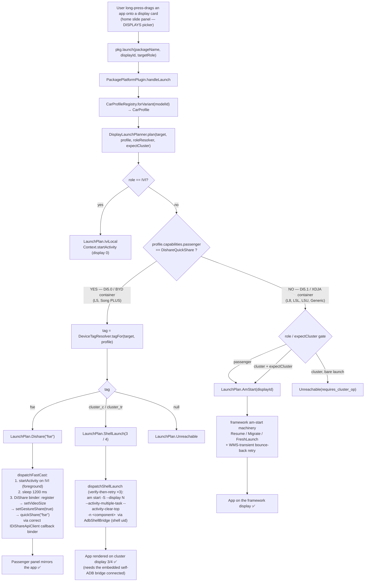

# 8. Audit — how display control is handled, Di5.1 vs Di5.0

The single end-to-end picture: one drop in the slide panel → which
transport runs, and why it differs by DiLink generation.

## The one decision diagram



ASCII fallback (same logic):

```
drop → pkg.launch → handleLaunch → forVariant → DisplayLaunchPlanner.plan
  ├─ role == IVI ............................. IviLocal (startActivity, display 0)
  └─ capabilities.passenger == DishareQuickShare ?
      ├─ YES  Di5.0 / BYD container (L5, Song PLUS)
      │     DeviceTagResolver(target):
      │       fse ................ Dishare("fse")  → dispatchFastCast
      │                            (foreground IVI → 1200ms → quickShare)
      │       cluster_c|cluster_tr  ShellLaunch(3|4) → dispatchShellLaunch
      │                            (am start -S --display N … via shell ADB,
      │                             verify-then-retry ×3)
      │       null .............. Unreachable
      └─ NO   Di5.1 / XDJA container (L8, L5L, L5U, Generic)
            role/expectCluster gate → AmStart(displayId)
              → framework Resume/Migrate/FreshLaunch + bounce-back
```

## Screen × generation transport matrix

| Screen | Di5.0 (BYD container — L5, Song PLUS) | Di5.1 (XDJA — L8, L5L, L5U) |
|--------|--------------------------------------|------------------------------|
| **IVI / Head Unit** (display 0) | `IviLocal` — `Context.startActivity` | `IviLocal` — `Context.startActivity` |
| **Passenger / FSE** | `Dishare("fse")` — DiShare mirror; **synthetic picker card** (OS doesn't enumerate display 2); foreground-on-IVI → 1200 ms → quickShare | `AmStart(2)` — framework `am start --display 2` |
| **Cluster** (Small Panel 3 / Driver Dashboard 4) | `ShellLaunch(3\|4)` — `am start -S --display N …` over shell-uid ADB, verify-then-retry | `AmStart(5)` — framework am-start, behind the cluster permission gate (`expectCluster`) |
| **Cluster touchpad** (drive the placed app from the IVI trackpad) | cursor on **4** (identity remap); tap on **2** (`inputRemap {4→2}`) — display 4 has no touchable window, the cast app's input window is on the DiShare source | cursor on **5** (`cursorRemap {3→5,5→5}`); tap on **3** (`inputRemap {5→3}`) — display 3 mirrors the eyeline cluster 5 |
| **Unknown / Generic** | `GENERIC_DI50` **inherits the full `DI50_BYD_DISHARE` topology** → same cluster + touchpad routing as L5 (cap bits stay conservative) | `GENERIC_DI51` → am-start fallback, conservative empty cluster |

## The fork — one boolean, one source of truth

The entire Di5.0↔Di5.1 split is **`profile.capabilities.passenger
== DishareQuickShare`**, which is itself a function of the **DiLink
generation / container** (Di5.0 = BYD container = DiShare; Di5.1 =
XDJA = framework am-start). It is *not* a per-model decision —
`2=fse · 3=cluster_c · 4=cluster_tr` is a BYD-container constant
identical on every Di5.0 car. Because the topology is a generation
constant, **`GENERIC_DI50` inherits the full `DI50_BYD_DISHARE`
display profile** — any unprofiled Di5.0 BYD-container car (walk-in /
new sub-trim) gets the same cluster + touchpad routing without a
dedicated trim file (cap bits stay conservative so mini-app cluster
caps still require an explicit profile). The Di5.1 generic path
(`GENERIC_DI51`) stays separate. The `CarProfile` still owns the
per-trim **cosmetics & topology**: `overrideLabels`,
`hiddenDisplayIds`/dim reasons, `secondaryDisplayOwners`,
`clusterDisplayId`, cursor/input/zoom remaps, and the
`dilinkFamily`/capability value itself. (Recommended follow-up: fork directly on `dilinkFamily` so a
mis-set capability bit can't regress a generation — see commit log;
the L5U=Di5.1 / Song PLUS=Di5.0 corrections are why.)

## What is verified on-car (live L5, 2026-05-18)

| Path | Status |
|------|--------|
| Detection → `l5` → `LEOPARD5_PROFILE` | ✅ proven |
| DiShare binder protocol (opcodes 1/8/9/11, callback binder, reply) | ✅ proven — DiShare's own service acks our client by package |
| Synthetic FSE card renders in picker | ✅ on-car: 4 cards (Head Unit / Small Panel / Driver Dashboard / FSE Co-pilot) |
| **Passenger / FSE cast** | ✅ working |
| **Cluster (Driver / Small Panel)** via shell am-start | ✅ command proven to render an app on displays 3 & 4 (host shell); in-app depends on the embedded self-ADB bridge being connected at drop time |
| **Cluster touchpad** (cursor + tap on the placed app) | ✅ on-car 2026-05-20: cursor visible on Driver Dashboard (4), `input -d 2 tap` reaches the cast, `input -d 4 tap` drops (`no touchable window in display 4`). Encoded as `cursorRemap=∅` / `inputRemap={4→2}`. |
| Small Panel display-group re-home | mitigated by verify-then-retry ×3 |
| Di5.1 (L8) am-start + cluster gate | unchanged (pre-existing, covered by `DisplayLaunchPlannerTest`) |

## Operational note (Di5.0 cluster only)

The cluster path runs `am start` over car-ilink's embedded
self-ADB bridge (`AdbShellBridge` → loopback adbd, shell uid). The
*command* is proven correct (host `adb shell am start --display
3/4` lands an app visibly on the cluster). The only residual is
ensuring the in-app self-ADB bridge is **connected/authorized** at
drop time (the app's own adb key approved with "Always allow") — a
robustness item, not a mechanism issue. See `07-open-issues-and-diagnostics.md`.
